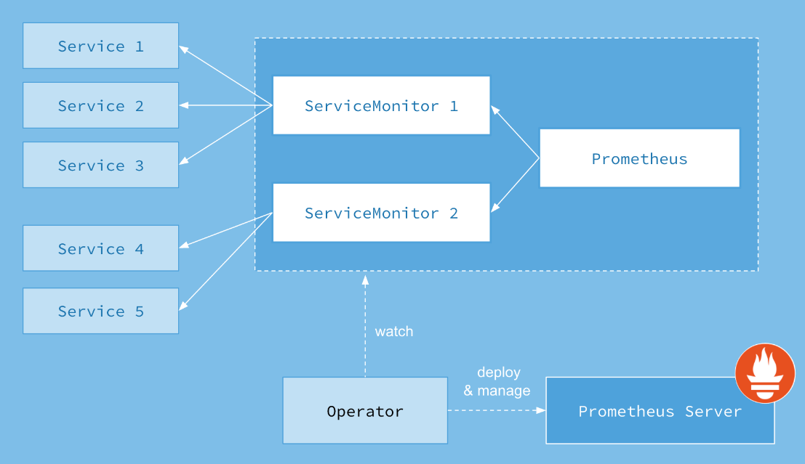

## 一、概述

Prometheus是一种开源的监控和警报工具，用于收集和记录应用程序和系统的度量数据。它特别适用于在Kubernetes集群中监控容器化应用程序。Kubernetes集群中通常与Prometheus一起使用的组件是Prometheus Operator和Grafana。

以下是在Kubernetes中使用Prometheus的主要步骤：

- **安装Prometheus Operator**： Prometheus Operator是一种Kubernetes控制器，用于简化Prometheus的部署和管理。您可以通过在Kubernetes中部署Prometheus Operator来自动设置和管理Prometheus实例。

- **配置Prometheus实例**： Prometheus Operator将通过Kubernetes的自定义资源定义（CRD）创建和管理Prometheus实例。您可以使用PrometheusRule CRD定义监控规则，并使用ServiceMonitor CRD定义需要监控的目标（例如Kubernetes服务）。

- **配置和导入Dashboard**： Grafana通常与Prometheus一起使用，用于可视化监控指标。您可以在Grafana中导入Prometheus的预定义仪表板或自定义仪表板来查看和分析度量数据。

- **监控应用程序和系统**： Prometheus通过HTTP端点从目标应用程序和系统中拉取度量数据。您可以在应用程序中暴露Prometheus格式的度量数据，并在ServiceMonitor中定义用于监控的目标。

- **警报配置**： Prometheus还支持配置警报规则，以便在达到特定阈值或条件时触发警报。警报规则可以定义为PrometheusRule CRD。

请注意，Prometheus和Prometheus Operator的配置和使用在实际环境中可能会因版本和具体的Kubernetes发行版而有所不同。为了获得更详细和准确的指导，请查阅官方文档和适用于您特定环境的教程。


以前也讲过prometheus，如果想查阅我之前prometheus教程，地址如下：

- [Prometheus原理详解](https://mp.weixin.qq.com/s?__biz=MzI3MDM5NjgwNg==&mid=2247486147&idx=1&sn=0c1bc2f3b8b0b5c90ce9fa174a32259f&chksm=ead0f62adda77f3cad2f1ddfb9910f414ce2889f26118a416fb1c4b01f65d5eee885ffc09ce8#rd)
- [Kubernetes（k8s）部署Promehteus（kube-prometheus&kube-prometheus-stack）监控](https://mp.weixin.qq.com/s?__biz=MzI3MDM5NjgwNg==&mid=2247486093&idx=1&sn=e4790ddf22f3d5e6c0824bfd0e84c073&chksm=ead0f664dda77f7239e137dcf9a2a5ca7da29e83f97d113e037b1527a47656ced717110eaa41#rd)
- [【云原生】Kubernetes 有状态应用程序控制器 Operator](https://mp.weixin.qq.com/s?__biz=MzI3MDM5NjgwNg==&mid=2247486396&idx=1&sn=8e379ab3288d44662d73af8a3d4c66f0&chksm=ead0f755dda77e432ef232ec32dc0b0744c00b3030f54d53d36c44719be56bd9449a7fcaa555#rd)
- [【云原生】Prometheus+Grafana on K8s 环境部署](https://mp.weixin.qq.com/s?__biz=MzI3MDM5NjgwNg==&mid=2247486420&idx=1&sn=dbb82628e7ce6b9091b7b058b444bbce&chksm=ead0f73ddda77e2bb500d15439be7f89c55e9a8ed5b7a38fcb47b3b5d6babba981894607c93d#rd)
- [【云原生】Prometheus+Grafana 监控 k8s 资源实战操作](https://mp.weixin.qq.com/s?__biz=MzI3MDM5NjgwNg==&mid=2247486466&idx=1&sn=e00883e50e8c47ee5538709da67bcfcb&chksm=ead0f0ebdda779fd88da6f16048a7fbf649123072e308aa9ba9de2c92063d4bf75338a3b7100#rd)
- [【云原生】Prometheus Pushgetway讲解与实战操作](https://mp.weixin.qq.com/s?__biz=MzI3MDM5NjgwNg==&mid=2247486932&idx=1&sn=b868276cef70bd05cdad2dcaec4e3b60&chksm=ead0f13ddda7782b5a57e448d34624e407183e40812c919a982991c9a844832dac009ecc8bcf#rd)
- [【云原生】Prometheus AlertManager讲解与实战操作](https://mp.weixin.qq.com/s?__biz=MzI3MDM5NjgwNg==&mid=2247486944&idx=1&sn=860e7ae0e35426f0f04a3870643f9fbc&chksm=ead0f109dda7781f8e183b1b5e2491bd6c6bc1bebc6851562d9914b93ebc4f37aa2c3f6f6fb3#rd)
- [【云原生】Prometheus PromQL讲解与实战操作](https://mp.weixin.qq.com/s?__biz=MzI3MDM5NjgwNg==&mid=2247487098&idx=1&sn=e7501c44fa6524ce8d75fc640a55907d&chksm=ead0f293dda77b85405323efad479a36409b46ea409b621d5c581c7aac3a77d912ce4e8fd671#rd)
- [【云原生】Prometheus 自定义告警规则](https://mp.weixin.qq.com/s?__biz=MzI3MDM5NjgwNg==&mid=2247487105&idx=1&sn=d7e3b326b1b90f51b56f8172b8ae3a7f&chksm=ead0f268dda77b7ee063e2c26f78b841990a62bbd41dc88105c25332d54f0d72bed948ffb3a3#rd)
- [【云原生】Grafana 介绍与实战操作](https://mp.weixin.qq.com/s?__biz=MzI3MDM5NjgwNg==&mid=2247487107&idx=1&sn=2bb980b75375dbfe0c2342cf2a762e04&chksm=ead0f26adda77b7cec0a7a064f26e7eb8b67ec96936f03dd7b80e092cdd00b880773a922e1df#rd)
- [【云原生】Grafana Alerting 告警模块介绍与实战操作](https://mp.weixin.qq.com/s?__biz=MzI3MDM5NjgwNg==&mid=2247487109&idx=1&sn=666df101b54eaec8d2d21f49837e83bc&chksm=ead0f26cdda77b7a6f1cb95b0fcd2ca067a596b3b5b06ad7ee714f17cb5db78cd1926ca0b4fc#rd)

## 二、常见的几款监控工具
以下这些工具可以用于在 Kubernetes 集群中实现监控和指标收集，以便于监视集群中的各种资源和应用的性能。

- `Heapster`：Heapster 是一个 Kubernetes 集群的资源监控工具，用于收集和汇总资源使用情况数据，如 CPU、内存、网络等。

- `Metrics Server`：Metrics Server 是 Kubernetes 官方提供的一个轻量级指标收集器，用于提供节点和 Pod 等资源的实时性能指标，可以用于水平自动扩展等。

- `Prometheus Operator`：Prometheus Operator 是一个 Kubernetes 控制器，用于管理和部署 Prometheus 和相关的监控组件。它可以自动创建和管理 Prometheus 实例、ServiceMonitor 和其他配置。

- `kube-prometheus` 或 `kube-prometheus-stack`：这是一个基于 Prometheus 的 Kubernetes 集群监控解决方案。它包含了一系列组件，用于部署和管理 Prometheus、Alertmanager、Grafana 等，以实现对 Kubernetes 集群和应用的全面监控。

> heapster-》metrics-server-》prometheus-operator -》kube-prometheus-》kube-prometheus-stack

-  [prometheus-operator GitHub地址](https://github.com/prometheus-operator/prometheus-operator)
- [kube-prometheus GitHub地址](https://github.com/prometheus-operator/kube-prometheus)
-  [ kube-prometheus-stack GitHub地址](https://github.com/prometheus-community/helm-charts/tree/main/charts/kube-prometheus-stack)

这些工具的组合可以帮助您搭建一个完整的监控系统，用于监视 Kubernetes 集群中的资源利用率、应用的性能、服务的可用性等指标。请注意，随着时间的推移，Kubernetes 社区的工具和技术也可能会有变化和演进，因此在使用这些工具时，建议查阅相关文档以获得最新信息和最佳实践。

### 1）kube-prometheus 和 kube-prometheus-stack 区别
`"kube-prometheus"` 和 `"kube-prometheus-stack"` 本质上是同一个项目，只是在不同的时间和版本中使用了不同的名称。`"kube-prometheus-stack"` 是 `"kube-prometheus"` 项目的更新版本，它提供了更多的功能、改进和修复。

- 最初，项目被称为 `"kube-prometheus"`，但随着时间的推移，项目团队对项目进行了大量的改进和扩展，并将其重命名为 `"kube-prometheus-stack"`，以更好地反映其提供的综合性监控解决方案。

- `"kube-prometheus-stack"`（或简称 `"kube-prometheus"`）是一个在 `Kubernetes` 集群中部署和管理 Prometheus 监控系统以及相关组件的综合解决方案。它集成了 Prometheus、Grafana、Alertmanager 等一系列组件，还包括预配置的监控规则和仪表盘，以及一键部署功能。用户可以通过部署 `"kube-prometheus-stack"` 来快速启动一个全面的 Kubernetes 集群监控系统，无需逐个配置各个组件。

总结起来，`"kube-prometheus-stack"` 是 `"kube-prometheus"` 项目的更新版本，提供更多的功能和改进，是一个便捷的综合性监控解决方案，适合在 Kubernetes 环境中快速部署和使用。
### 2）Prometheus Operator 和kube-prometheus 或 kube-prometheus-stack对比

> `"Prometheus Operator"` 和 `"kube-prometheus"`（或 `"kube-prometheus-stack"`）都是用于在 `Kubernetes` 集群中部署和管理 `Prometheus` 监控系统的工具。它们有一些相似之处，但也存在一些区别。以下是它们的主要特点和区别的对比：

`Prometheus Operator`：

- **核心功能**：Prometheus Operator 是一个 Kubernetes 控制器，专门用于管理 Prometheus 和相关组件的配置和部署。它自动创建和管理 Prometheus 实例、ServiceMonitor、Alertmanager、PrometheusRule 等 Kubernetes 资源。

- **声明式配置**：Prometheus Operator 通过自定义资源定义（`Custom Resource Definitions，CRDs`）来实现声明式配置。您可以创建 `Prometheus、ServiceMonitor` 等资源对象来定义监控配置，`Operator` 会根据这些定义自动创建和维护相关的资源。

- **自动发现**：`Prometheus Operator` 支持自动发现 `Kubernetes` 中的 `Service`、`Pod`、`Namespace` 等资源，无需手动配置每个监控目标。

- **生态系统整合**：`Prometheus Operator` 集成了 `Grafana` 和 `Alertmanager`，并可以轻松与其他监控工具集成。

- **灵活性**：`Prometheus Operator` 允许根据不同的需求和配置选择性地部署多个 Prometheus 实例，每个实例可以针对特定的监控任务进行配置。

`kube-prometheus` 或 `kube-prometheus-stack`：

- **综合解决方案**：kube-prometheus（或 kube-prometheus-stack）是一个完整的监控解决方案，集成了 Prometheus、Grafana、Alertmanager 等一系列组件，以及一些预配置的监控规则和仪表盘。

- **快速启动**：kube-prometheus 提供了一键式的部署方式，适合快速启动一个完整的监控系统，无需逐个配置各个组件。

- **预配置规则和仪表盘**：kube-prometheus 提供了一些默认的监控规则和 Grafana 仪表盘，可以快速启用监控功能。

- **集成和扩展**：由于 kube-prometheus 集成了多个组件，您可以使用这个解决方案来快速部署一个全面的监控系统，并且可以根据需要进行定制和扩展。

综合来看，Prometheus Operator 专注于 Prometheus 和相关资源的管理和自动化配置，而 kube-prometheus 或 kube-prometheus-stack 则是一个更加综合的解决方案，适合快速启动一个完整的监控系统，尤其对于刚开始使用 Prometheus 的用户来说，可以减少配置的复杂性。您可以根据实际需求和情况选择合适的工具。
## 三、Prometheus Operator 架构


`Prometheus Operator` 是一个用于在 `Kubernetes` 集群中自动化部署和管理 `Prometheus` 监控系统的控制器。它采用了声明式配置的方式，通过 Kubernetes 自定义资源定义（`Custom Resource Definitions`，CRDs）来定义和管理 `Prometheus`、`ServiceMonitor`、`Alertmanager`、`PrometheusRule` 等资源对象。以下是 Prometheus Operator 的架构说明：

- **Prometheus Operator 控制器**：Prometheus Operator 控制器是一个运行在 Kubernetes 集群中的控制器，负责监听 Prometheus 相关的自定义资源变化，根据变化自动执行相应的操作。

- **Prometheus CRD**：`Prometheus Operator` 引入了自定义资源定义（CRD） Prometheus，用于定义 Prometheus 实例的配置。在 Prometheus CRD 中，您可以定义监控的规则、数据存储、数据保留策略等。

- **ServiceMonitor CRD**：ServiceMonitor 是另一个自定义资源，用于定义要监控的应用程序。每个 ServiceMonitor 都关联到一个或多个 Kubernetes 的 Service，Prometheus Operator 将自动发现这些关联的服务，并生成适当的监控配置。

- **Alertmanager CRD**：类似于 Prometheus 和 ServiceMonitor，Prometheus Operator 还支持 Alertmanager 自定义资源，用于定义 Alertmanager 实例的配置。

- **PrometheusRule CRD**：PrometheusRule 自定义资源用于定义 Prometheus 的告警规则。通过这些规则，您可以指定应该在 Prometheus 中生成哪些告警。

- **自动发现和配置生成**：Prometheus Operator 根据定义的 ServiceMonitor 和 PrometheusRule 自动发现和生成相应的监控配置。它会监听 Kubernetes 中的变化，如服务的创建、删除或标签的变更，以及规则的更新，然后自动更新 Prometheus 的配置文件。

- **Prometheus 部署**：Prometheus Operator 会基于 Prometheus 自定义资源的定义，在 Kubernetes 集群中部署 Prometheus 实例。Operator 负责管理配置、Pod 的生命周期、版本升级等。

- **集成 Grafana 和 Alertmanager**：Prometheus Operator 通常也与 Grafana 和 Alertmanager 集成，可以配置 Grafana 和 Alertmanager 自定义资源，以便自动部署和配置这些组件。

**ServiceMonitor 作用和示例讲解：**

> `ServiceMonitor` 是 `Prometheus Operator ` 中的一个自定义资源定义（CRD），用于定义要监控的应用程序服务。它的作用是指定哪些服务需要被 Prometheus 监控，以及如何进行监控。`ServiceMonitor` 在 Prometheus Operator 中的使用非常重要，因为它能够自动发现被监控的服务，并生成适当的监控配置。

下面是一个 `ServiceMonitor` 的示例讲解：

假设有一个名为 `"my-app"` 的应用程序在 `Kubernetes` 集群中运行，我们希望 `Prometheus` 监控该应用程序的性能指标。首先，我们需要创建一个 `ServiceMonitor` 自定义资源来定义该应用程序的监控配置。

```yaml
apiVersion: monitoring.coreos.com/v1
kind: ServiceMonitor
metadata:
  name: my-app-monitor
  namespace: default
spec:
  selector:
    matchLabels:
      app: my-app
  endpoints:
    - port: web
      interval: 30s
```
在上述示例中：

- `apiVersion` 和 `kind` 指定了这是一个 `ServiceMonitor` 自定义资源。

- `metadata` 中的 `name` 指定了 `ServiceMonitor` 对象的名称。

- `spec` 部分定义了监控的配置。在 `selector` 中，我们使用了 matchLabels 来选择带有 `app: my-app` 标签的 `Pod`。这意味着只有具有该标签的 `Pod` 会被监控。

- 在 `endpoints` 中，我们定义了监控的端点信息。在这个示例中，我们监控了名为 `"web"` 的端口，并指定了抓取数据的时间间隔为 `30` 秒。

> 通过创建这个 ServiceMonitor 对象，Prometheus Operator 将自动发现带有标签 app: my-app 的 Pod，并在 Prometheus 配置中生成相应的监控作业（job）。这样，Prometheus 就会定期抓取这些 Pod 的指标数据，以进行监控和告警。

通过使用 Prometheus Operator，您可以通过简单的声明式配置来自动管理和扩展 Prometheus 监控系统，从而使监控的部署和维护更加简单和可靠。


## 四、快速在k8s内搭建 Prometheus 全家桶
> 最开始是Heapster+cAdvisor方式监控，这是Prometheus Operator出现之前的k8s监控方案。后来出现了Prometheus Operator，但是目前Prometheus Operator已经不包含完整功能，完整的解决方案已经变为kube-prometheus（或kube-prometheus-stack）。

`"kube-prometheus"` 和 `"kube-prometheus-stack"` 本质上是同一个项目，只是在不同的时间和版本中使用了不同的名称。`"kube-prometheus-stack"` 是 `"kube-prometheus"` 项目的更新版本，它提供了更多的功能、改进和修复。

kube-prometheus-stack GitHub地址：[https://github.com/prometheus-community/helm-charts/tree/main/charts/kube-prometheus-stack](https://github.com/prometheus-community/helm-charts/tree/main/charts/kube-prometheus-stack)
### 1）k8s 环境安装
k8s 环境安装之前写过很多文档，可以参考我以下几篇文章：

- [【云原生】k8s 离线部署讲解和实战操作](https://mp.weixin.qq.com/s?__biz=MzI3MDM5NjgwNg==&mid=2247486688&idx=1&sn=e041392d219869c75cf36cca17ad81e5&chksm=ead0f009dda7791f8ef5221e49782d36b74426b6f406d22018b69e6322b3de40a215740eb4a1#rd)
- [【云原生】k8s 环境快速部署（一小时以内部署完）](https://mp.weixin.qq.com/s?__biz=MzI3MDM5NjgwNg==&mid=2247486963&idx=1&sn=c1c094f338d88c44c5b573cb2dd0b10f&chksm=ead0f11adda7780cd32d0e87ac30db538b834668b6948b91ebf3db7b1a05cf5819fcd6f41506#rd)
### 2）安装 helm
下载地址：[https://github.com/kubernetes/helm/releases](https://github.com/kubernetes/helm/releases)

```bash
# 下载包
wget https://get.helm.sh/helm-v3.7.1-linux-amd64.tar.gz
# 解压压缩包
tar -xf helm-v3.7.1-linux-amd64.tar.gz
# 制作软连接
ln -s /opt/helm/linux-amd64/helm /usr/local/bin/helm
# 验证
helm version
helm help
```
### 3）直接安装方式（kube-prometheus）

#### 1、下载 kube-prometheus
官方下载地址：[https://github.com/prometheus-operator/kube-prometheus](https://github.com/prometheus-operator/kube-prometheus)

#在官方的基础之上进行了修改和增加内容

本地址：[https://gitee.com/hadoop-bigdata/kube-prometheus.git](https://gitee.com/hadoop-bigdata/kube-prometheus.git)

```bash
git clone https://gitee.com/hadoop-bigdata/kube-prometheus.git
cd kube-prometheus
```
> 【注】在 `release-0.11` 版本之后新增了 `NetworkPolicy` 默认是允许自己访问，如果了解 `NetworkPolicy` 可以修改一下默认的规则，可以用查看 `ls manifests/*networkPolicy*`，如果不修改的话则会影响到修改 `NodePort` 类型也无法访问，如果不会 `Networkpolicy` 可以直接删除就行。
#### 2、修改镜像源（可选，下面已经提供了离线镜像包）
> 国外镜像源某些镜像无法拉取，我们这里修改prometheus-operator，prometheus，alertmanager，kube-state-metrics，node-exporter，prometheus-adapter的镜像源为国内镜像源。我这里使用的是中科大的镜像源。

```bash
# 查找
grep -rn 'quay.io' *
# 批量替换
sed -i 's/quay.io/quay.mirrors.ustc.edu.cn/g' `grep "quay.io" -rl *`
# 再查找
grep -rn 'quay.io' *
grep -rn 'image: ' *
```
这里也提供镜像包

> 链接：[https://pan.baidu.com/s/10ksK1OtKwlvZqbExKmZgLw?pwd=bcu6](https://pan.baidu.com/s/10ksK1OtKwlvZqbExKmZgLw?pwd=bcu6) 
提取码：`bcu6`


```
# 下载完镜像包，批量分发到所有k8s节点，解压进入镜像包目录，直接执行以下命令就可将所有镜像加载
sh load-images.sh
```

#### 3、修改 service 配置类型为 NodePort
> 为了可以从外部访问 `prometheus`，`alertmanager`，`grafana`，我们这里修改 `promethes`，`alertmanager`，`grafana`的 `service` 类型为 `NodePort` 类型。

##### 【1】修改 prometheus 的 service

```bash
# 设置对外访问端口，增加如下两行，完整配置也贴出来了。
# type: NodePort
# nodePort: 30090

vi manifests/prometheus-service.yaml
```
完整配置
```yaml
apiVersion: v1
kind: Service
metadata:
  labels:
    app.kubernetes.io/component: prometheus
    app.kubernetes.io/instance: k8s
    app.kubernetes.io/name: prometheus
    app.kubernetes.io/part-of: kube-prometheus
    app.kubernetes.io/version: 2.46.0
  name: prometheus-k8s
  namespace: monitoring
spec:
  type: NodePort
  ports:
  - name: web
    port: 9090
    targetPort: web
    nodePort: 30090
  - name: reloader-web
    port: 8080
    targetPort: reloader-web
  selector:
    app.kubernetes.io/component: prometheus
    app.kubernetes.io/instance: k8s
    app.kubernetes.io/name: prometheus
    app.kubernetes.io/part-of: kube-prometheus
  sessionAffinity: ClientIP
```

##### 【2】修改 grafana 的 service

完整配置

```bash
# 设置对外访问端口，增加如下两行，完整配置也贴出来了。
# type: NodePort
# nodePort: 30300
vi manifests/grafana-service.yaml
```
完整配置

```yaml
apiVersion: v1
kind: Service
metadata:
  labels:
    app.kubernetes.io/component: grafana
    app.kubernetes.io/name: grafana
    app.kubernetes.io/part-of: kube-prometheus
    app.kubernetes.io/version: 9.5.3
  name: grafana
  namespace: monitoring
spec:
  type: NodePort
  ports:
  - name: http
    port: 3000
    targetPort: http
    nodePort: 30300
  selector:
    app.kubernetes.io/component: grafana
    app.kubernetes.io/name: grafana
    app.kubernetes.io/part-of: kube-prometheus
```
##### 【3】修改 alertmanager 的 service

```bash
# 设置对外访问端口，增加如下两行，完整配置也贴出来了。
# type: NodePort
# nodePort: 30093
vi manifests/grafana-service.yaml
```
完整配置

```bash
apiVersion: v1
kind: Service
metadata:
  labels:
    app.kubernetes.io/component: alert-router
    app.kubernetes.io/instance: main
    app.kubernetes.io/name: alertmanager
    app.kubernetes.io/part-of: kube-prometheus
    app.kubernetes.io/version: 0.25.0
  name: alertmanager-main
  namespace: monitoring
spec:
  type: NodePort
  ports:
  - name: web
    port: 9093
    targetPort: web
    nodePort: 30093
  - name: reloader-web
    port: 8080
    targetPort: reloader-web
  selector:
    app.kubernetes.io/component: alert-router
    app.kubernetes.io/instance: main
    app.kubernetes.io/name: alertmanager
    app.kubernetes.io/part-of: kube-prometheus
  sessionAffinity: ClientIP
```
#### 4、开始安装

```bash
kubectl apply --server-side -f manifests/setup
kubectl wait \
	--for condition=Established \
	--all CustomResourceDefinition \
	--namespace=monitoring
kubectl apply -f manifests/

# 查看
kubectl get all -n monitoring
```

> 【温馨提示】如果上面下载镜像失败，可以使用以下地址下载，当然也可以去hub.docker.com下载。

#### 6、浏览器访问

**Prometheus**：`http://ip:30090/`


**Grafana** ：`http://ip:30300/`
默认账号/密码：`admin/admin`


**Alertmanager**：`http://ip:30093/`


#### 5、卸载

```bash
kubectl delete --ignore-not-found=true -f manifests/ -f manifests/setup
```

Prometheus on k8s 部署与部署实战操作进阶篇讲解就到这里了，后面深入讲解 Prometheus 全家桶使用，有任何疑问也可关注我公众号：`大数据与云原生技术分享`，进行技术交流，如本篇文章对您有所帮助，麻烦帮忙一键三连（**点赞、转发、收藏**）~

